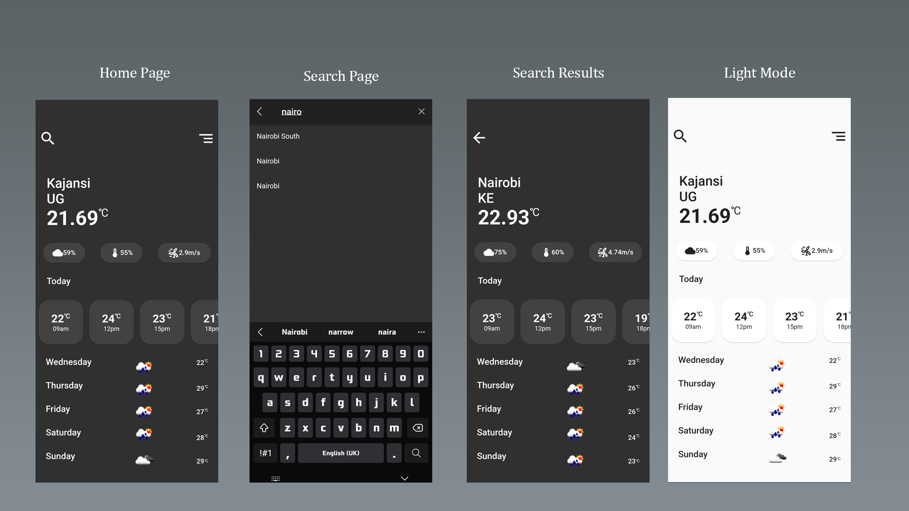

# weather
A simple weather application. Derives all the data from the [openweather API](https://openweathermap.org/)
Shows data for upto 5 days, with a 3 hour step. This was designed and developed using the [Google maps API](https://pub.dev/packages/google_maps_flutter) and [Geolocator](https://pub.dev/packages/geolocator). It also features a search function to find weather updates for other cities as well as permissions to access user's current location.

## Screenshot


## Requirements
1. [Flutter](https://docs.flutter.dev/get-started/install)
2. [Android Studio](https://developer.android.com/codelabs/basic-android-kotlin-compose-install-android-studio)

## Setting up dev
1. Clone the repository
    ```bash
    git clone <url>
    ```
2. Enter the created directory `weather` using the terminal
   ```bash
   cd weather
   ```
3. Install the necessary dependencies
   ```bash
   flutter pub get
   ```
4. Run the project
   - Either navigate the **lib/main.dart** file and click the `run` button
   - Or using the terminal
     ```bash
     flutter run
     ```

## Built with
1. [OpenWeatherMap](https://openweathermap.org/)
2. [Google maps](https://pub.dev/packages/google_maps_flutter)
3. [Geolocator](https://pub.dev/packages/geolocator)